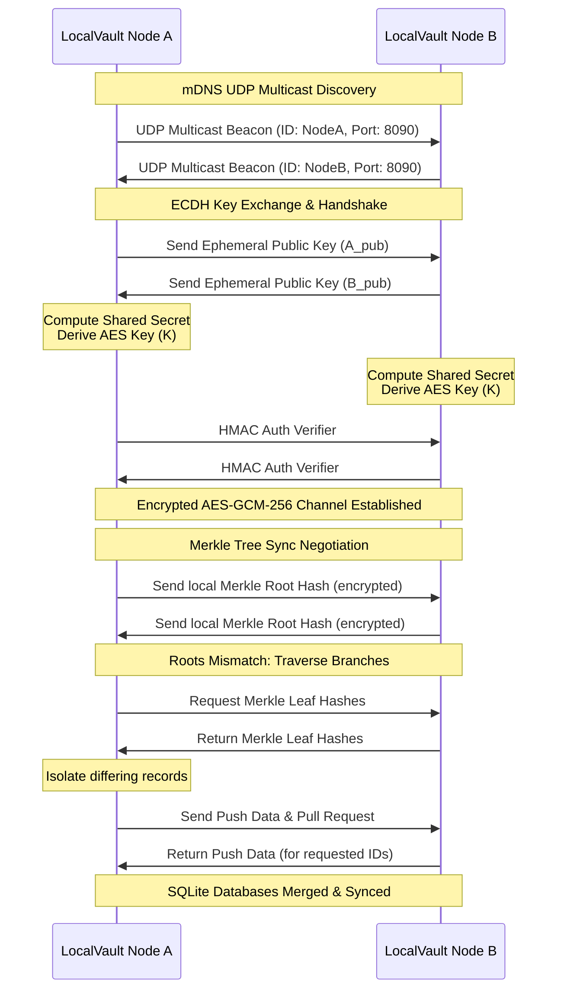

# LocalVault P2P Zero-Knowledge Sync Daemon (LocalVault2)

A highly secure, decentralized, peer-to-peer (P2P) database synchronization engine designed to keep multiple `LocalVault` instances in sync across a local network without relying on any centralized cloud servers.

## Key Features

- **mDNS LAN Node Discovery**: Automatic node discovery using UDP multicast beacons on `224.0.0.251:8765`. Nodes discover each other seamlessly on the local network without manual IP configuration.
- **ECDH Cryptographic Handshake**: Performs an Elliptic Curve Diffie-Hellman (ECDH) key exchange using the P-256 curve to derive unique session keys via HKDF-SHA256, protecting against active internal network snooping.
- **End-to-End Encryption**: Encrypts all sync payloads using AES-GCM-256 authenticated encryption with randomized 12-byte nonces.
- **Merkle Tree Differential Sync**: Constructs binary Merkle Trees of local database items. Nodes exchange tree root hashes and traverse branches to isolate differences, only transmitting the modified records (Delta Sync) to minimize network bandwidth.
- **Zero-Knowledge Architecture**: The P2P network layer operates with zero-knowledge verification. Session validation uses HMAC-SHA256 verifiers, ensuring only peers possessing the correct pre-shared sync password can decrypt and update the vault.

## Architecture & Protocols



## Getting Started

### Prerequisites

- Go 1.26.1 or higher
- SQLite database initialized by `LocalVault`

### CLI Usage

Build the binary:

```bash
go build -o localvault-sync
```

Start Node A on Port `8090` linking its database:

```bash
./localvault-sync -id node-A -port 8090 -password your_secret_password -db path/to/localvault_A.db
```

Start Node B on Port `8091` linking its database:

```bash
./localvault-sync -id node-B -port 8091 -password your_secret_password -db path/to/localvault_B.db
```

The daemons will automatically discover each other via UDP multicast, execute the ECDH handshake, authenticate using `your_secret_password`, compare database Merkle roots, and synchronize any differences in the background.

## Verification & Testing

To run the cryptographic and synchronization protocol unit tests:

```bash
go test -v ./...
```
